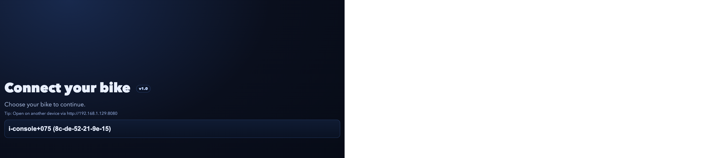
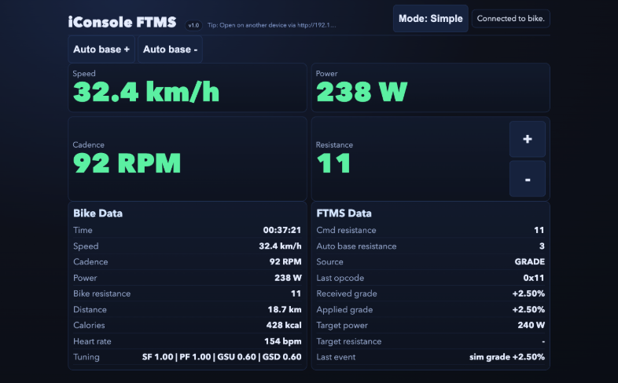

# iConsole FTMS (macOS)

Native macOS app that bridges selected iConsole bikes to MyWhoosh via FTMS.

## Install (recommended)

1. Open the latest release on GitHub:
   - https://github.com/msj33/iconsole_ftms/releases
2. Download `iConsole-FTMS-macOS-vX.Y.dmg`
3. Open the DMG
4. Drag **iConsole FTMS.app** to **Applications**
5. Start **iConsole FTMS** from Applications

### If macOS 26 blocks launch ("Apple could not verify...")

This can happen with older, non-notarized builds. New tagged releases are signed + notarized.
For older builds, run this once in Terminal:

```bash
# adjust version/path if needed
xattr -dr com.apple.quarantine "$HOME/Downloads/iConsole-FTMS-macOS-vX.Y.dmg"
hdiutil attach "$HOME/Downloads/iConsole-FTMS-macOS-vX.Y.dmg"
cp -R "/Volumes/iConsole FTMS/iConsole FTMS.app" "/Applications/"
xattr -dr com.apple.quarantine "/Applications/iConsole FTMS.app"
open "/Applications/iConsole FTMS.app"
```

If mounted volume is named `iConsole FTMS 2`, use that path in the `cp` command.

## Web frontend

### Connection screen



### Dashboard screen



### Keep iPad awake

- The web UI includes a **Keep awake** toggle (connection screen + dashboard).
- On supported browsers (Safari/iPadOS with Screen Wake Lock support), turn it on to prevent auto sleep while riding.

## What the app includes

- Native macOS app window (Dock/taskbar app)
- Bluetooth bridge to MyWhoosh as FTMS + Cycling Power device
- Connect-first bike selection screen
- Simple mode and Advanced mode UI
- Full-screen responsive dashboard layout
- Keep-awake toggle for iPad/tablet sessions
- Manual resistance `+/-` buttons
- Auto-base resistance controls for hill feel
- Automatic reconnect when bike is unavailable
- Local-network access hint (`192.x.x.x`) in UI
- App version shown in the UI

## Supported bike (current scope)

- Abilica Stream SB-X (iConsole+075)

## Optional runtime config file

Create:

`~/Library/Application Support/iConsoleFTMS/env.sh`

Example:

```bash
export ICONSOLE_BIKE_MAC=xx-xx-xx-xx-xx-xx
export ICONSOLE_WEB_PORT=8080
export ICONSOLE_VERBOSE=1
```

## Versioning and releases

- App version is stored in [VERSION](/Users/mortenstensgaard/git/iconsole/VERSION).
- Tag format: `v<version>` (example: `v1.0`).
- GitHub Actions builds and publishes a release DMG from tags:
  - [release.yml](/Users/mortenstensgaard/git/iconsole/.github/workflows/release.yml)
